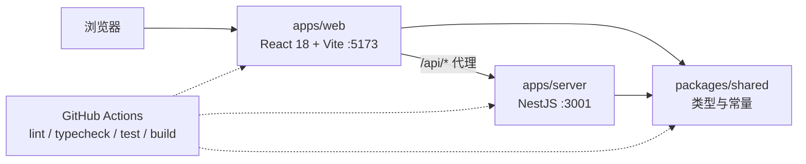

# AI 广告投放 Copilot + 低代码搭建平台（Demo）

Day1 交付的是可运行、可校验的工程骨架：pnpm monorepo、前后端可启动、基础布局与四条路由、Lint/类型检查/单测/CI 全链路打通。

当前**不接数据库、不接 LLM、不做业务**，唯一的后端接口是探活用的 `GET /api/health`。

## 技术栈

| 层     | 选型                                                               |
| ------ | ------------------------------------------------------------------ |
| 前端   | React 18 + TypeScript + Vite + Ant Design + React Router + Zustand |
| 后端   | Node.js + NestJS + TypeScript                                      |
| 共享层 | `@ai-ad-copilot/shared`（跨端类型与常量）                          |
| 测试   | 前端 Vitest + Testing Library，后端 Jest                           |
| 工程   | ESLint(flat config) + Prettier + GitHub Actions                    |

## 架构



数据流：浏览器访问 `/api/*` 由 Vite dev server 代理到 NestJS；NestJS 用全局拦截器把返回值包装成 `ApiResponse<T>`，用全局异常过滤器把错误包装成 `ApiErrorResponse`，两端结构都由 `packages/shared` 定义。

## 目录结构

```
apps/
  web/                 React 18 + Vite 前端
    src/
      layouts/         基础布局（侧边栏 + 顶部栏）
      router/          路由表与侧边栏菜单数据
      pages/           Dashboard / AI Copilot / LowCode / RAG / NotFound
      components/      通用组件（Day1 只有页面占位组件）
      stores/          Zustand 状态
      test/            测试专用入口组件
  server/              NestJS 后端
    src/
      modules/health/  探活接口
      common/          异常过滤器、响应拦截器、错误码
      app.setup.ts     全局装配（main.ts 与集成测试共用）
packages/
  shared/              跨端类型与常量（tsc 编译到 dist）
.github/workflows/     CI
```

## 环境要求

- Node.js 22 LTS（仓库内 `.nvmrc` 已写 `22`；本地当前若是 24.x 也能跑，但 CI 与文档以 22 为准）
- pnpm（版本由根 `package.json` 的 `packageManager` 字段锁定）
- Windows PowerShell 下 `pnpm` / `npm` 的 `.ps1` 包装脚本可能被执行策略拦截，请统一用 `pnpm.cmd`，或执行 `Set-ExecutionPolicy -Scope Process RemoteSigned`

## 启动方式

```bash
pnpm.cmd install          # 安装依赖
pnpm.cmd dev              # 同时启动前端(5173) 与后端(3001)
```

也可以单独启动：

```bash
pnpm.cmd --filter @ai-ad-copilot/web dev
pnpm.cmd --filter @ai-ad-copilot/server dev
```

注意：`packages/shared` 需要先构建出 `dist`（根 `dev` / `typecheck` / `test` 脚本已自动处理）。单独调试 shared 时可跑 `pnpm.cmd --filter @ai-ad-copilot/shared dev` 进入 watch 模式。

## 验收命令

```bash
pnpm.cmd lint        # ESLint，零 warning 通过
pnpm.cmd typecheck   # tsc --noEmit，三个包全部通过
pnpm.cmd test        # Vitest(shared/web) + Jest(server)
pnpm.cmd build       # shared -> web/server 按依赖顺序构建
```

CI（`.github/workflows/ci.yml`）在 push 到 `main` 与所有 PR 上执行同样四步。

## Day1 Demo 内容

1. 启动后访问 http://localhost:5173 ，侧边栏含 Dashboard / AI Copilot / LowCode / RAG 四个入口；
2. 顶部栏显示当前页面标题，折叠按钮可收起侧边栏；
3. 点击菜单切换路由，根路径自动重定向到 `/dashboard`，未知路径显示 404；
4. 后端 `GET http://localhost:3001/api/health` 返回 `{"code":0,"message":"ok","data":{...}}`，未知路由返回统一错误结构。

## 后续规划

- Day2：Prisma + PostgreSQL 数据层、Dashboard 指标卡与 ECharts 图表
- Day3：AI Copilot 对话与 SSE 流式输出
- Day4：低代码 Schema 生成与渲染
- Day5：RAG 知识库检索问答
- 贯穿：Playwright E2E（当前 CI 尚未包含，属于已知缺口）
