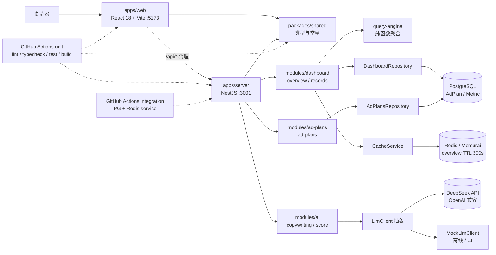

# AI 广告投放 Copilot + 低代码搭建平台（Demo）

Day1 交付可运行、可校验的工程骨架：pnpm monorepo、前后端可启动、基础布局与四条路由、Lint/类型检查/单测/CI 全链路打通。

Day2 交付广告数据看板：顶部筛选（日期区间 / 渠道多选 / 广告计划）、6 张指标卡、3 个 ECharts 图表（消耗点击趋势、渠道对比、转化漏斗）、支持排序分页与列筛选的明细表，并把构建产物按路由懒加载 + manualChunks 拆到全部 chunk < 500KB。

Day3 交付看板的后端数据链路：Prisma + PostgreSQL 承载近 90 天投放事实，Redis 缓存 overview，三个接口按 Day2 契约落到 NestJS，并用真实 PG + Redis 跑集成测试。

Day4a 交付 AI 文案助手：LLM 客户端抽象（DeepSeek / Mock 双实现，环境变量切换）+ SSE 流式接口（一次生成 3 个版本、流式改写、打分），前端用 `fetch + ReadableStream` 消费 SSE，支持停止生成与错误反馈。看板与文案助手都支持 mock 离线模式（`VITE_API_MODE=mock`），设为 `real` 即走真实后端，页面、hooks、store 零改动。

## 技术栈

| 层     | 选型                                                               |
| ------ | ------------------------------------------------------------------ |
| 前端   | React 18 + TypeScript + Vite + Ant Design + ECharts + React Router + Zustand |
| 后端   | Node.js + NestJS + TypeScript + Prisma + PostgreSQL + Redis        |
| AI     | OpenAI SDK（DeepSeek 兼容协议）+ SSE 流式 + 可切换的 Mock LLM          |
| 共享层 | `@ai-ad-copilot/shared`（跨端类型与常量）                          |
| 测试   | 前端 Vitest + Testing Library；后端 Jest 单测 + 真实 PG/Redis 集成测试 |
| 工程   | ESLint(flat config) + Prettier + GitHub Actions（unit + integration 双 job） |

## 架构



数据流：浏览器访问 `/api/*` 由 Vite dev server 代理到 NestJS；NestJS 用全局拦截器把返回值包装成 `ApiResponse<T>`，用全局异常过滤器把错误包装成 `ApiErrorResponse`，两端结构都由 `packages/shared` 定义。

后端分层：`Controller`（DTO + `ValidationPipe` 校验）→ `Service`（区间语义校验、缓存编排、分页排序）→ `Repository`（唯一的 Prisma 边界，`@db.Decimal` 在这里 `.toNumber()`、`@db.Date` 在这里转 `YYYY-MM-DD`）→ `query-engine` 纯函数做聚合。`overview` 走 `CacheService.withCache`，Redis 故障时 fail-open 直查数据库。

## 目录结构

```
apps/
  web/                 React 18 + Vite 前端
    src/
      layouts/         基础布局（侧边栏 + 顶部栏）
      router/          路由表与侧边栏菜单数据（Dashboard 路由级懒加载）
      pages/           Dashboard（看板编排 + 筛选栏 / 明细表 / 查询逻辑）/ AI Copilot / LowCode / RAG / NotFound
      components/      通用组件（MetricCard / ChartCard / PageFallback）
      components/charts/   BaseChart（唯一接触 echarts 的组件）+ chartOptions 纯函数 + 具体图表
      hooks/           异步数据 hooks（useAsyncResource / 概览 / 明细 / 计划下拉）
      services/        数据源与接口契约（http + mock 两种实现，可切换到真实后端）
      stores/          Zustand 状态（含看板筛选）
      utils/           日期与格式化纯函数
      test/            测试专用入口组件与全局测试桩
  server/              NestJS 后端
    src/
      modules/dashboard/  看板接口（controller / service / repository / DTO / query-engine 纯函数 / seed 数据生成器）
      modules/ad-plans/   广告计划下拉接口
      modules/ai/         AI 文案（LLM 抽象与双实现、prompt 模板、SSE 帧、DTO、controller / service）
      modules/health/     探活接口
      common/cache/       CacheService 抽象 + Redis / 内存实现 + cache key 纯函数
      common/utils/       日期工具（UTC 零点代表业务日）与 shared 契约守卫
      common/             异常过滤器、响应拦截器、错误码
      prisma/             PrismaService / PrismaModule / seed 环境守卫
      app.setup.ts        全局装配（main.ts 与集成测试共用）
    prisma/               schema.prisma / migrations / seed.ts
    test/                 集成测试脚手架（jest-integration.json + setup.ts）
packages/
  shared/              跨端类型与常量（tsc 编译到 dist）
.github/workflows/     CI
```

## 接口契约（Day2 看板）

前后端共用 `packages/shared/src/types/dashboard.ts` 的类型与常量。日期为 `YYYY-MM-DD` 闭区间（业务日切按 Asia/Shanghai），数组参数用逗号分隔，空值不进入 query。当前前端以 mock 实现落地，后端就绪后按同一契约实现即可。

| 方法 | 路径                      | 说明                                                       |
| ---- | ------------------------- | ---------------------------------------------------------- |
| GET  | `/api/dashboard/overview` | 指标卡 + 趋势 + 渠道对比 + 漏斗，一次请求返回整屏聚合结果  |
| GET  | `/api/dashboard/records`  | 广告计划明细（服务端分页 / 排序 / 列筛选）                 |
| GET  | `/api/ad-plans`           | 广告计划下拉选项（可按渠道、状态、关键字收窄）             |

| 接口     | 参数                                                       | 类型                              |
| -------- | ---------------------------------------------------------- | --------------------------------- |
| overview | `from`, `to`                                               | `string`（YYYY-MM-DD，必填）      |
| overview | `channels`                                                 | `AdChannel[]`（逗号分隔，省略=全部） |
| overview | `planId`                                                   | `string`                          |
| records  | overview 全部参数 + `page`, `pageSize`                     | `number`                          |
| records  | `sortField`, `sortOrder`                                   | `AdRecordSortField` / `asc\|desc` |
| records  | `statuses`, `keyword`                                      | `AdPlanStatus[]` / `string`       |
| ad-plans | `channels`, `statuses`, `keyword`                          | 同上，均可选                      |

| 接口     | `data` 类型                 | 关键字段                                                                        |
| -------- | --------------------------- | ------------------------------------------------------------------------------- |
| overview | `DashboardOverview`         | `metrics` / `previous`（环比对照期）/ `trend` / `channels` / `funnel` / `updatedAt` |
| records  | `PageResult<AdPlanRecord>`  | `list` / `total` / `page` / `pageSize`                                          |
| ad-plans | `AdPlanOption[]`            | `planId` / `planName` / `channel` / `status`                                    |

口径：`spend` / `revenue` 单位为元；`ctr` / `cvr` 返回比值（`0.0342` 表示 3.42%），百分比与万/亿单位由前端 `utils/format.ts` 统一渲染；`roi = revenue / spend`，分母为 0 时返回 0。错误沿用 `ApiErrorResponse`（`code` / `message` / `details`），前端 `services/http.ts` 统一转成 `ApiRequestError` 供 UI 展示。

错误码约定：参数格式 / 渠道白名单等校验失败返回 `40000`；日期区间语义非法（起止颠倒、跨度超过 90 天）返回 `40001`。

### 请求 / 响应示例（Day3 实测）

seed 窗口为 `2026-06-23 ~ 2026-09-20`（90 天 × 30 计划 = 2640 行事实），以下数值即该数据集下的真实返回。

```bash
curl "http://localhost:3001/api/dashboard/overview?from=2026-09-07&to=2026-09-20"
```

```json
{
  "code": 0,
  "message": "ok",
  "data": {
    "query": { "from": "2026-09-07", "to": "2026-09-20" },
    "metrics": {
      "spend": 528299.74,
      "revenue": 3330302.15,
      "impressions": 13421138,
      "clicks": 446091,
      "conversions": 35543,
      "ctr": 0.0332,
      "cvr": 0.0797,
      "roi": 6.3
    },
    "previous": { "spend": 613018.69, "revenue": 3537672.11, "...": "同 metrics 结构，等长上一周期" },
    "trend": [{ "date": "2026-09-07", "spend": 17842.3, "clicks": 15234, "conversions": 1201 }],
    "channels": [{ "channel": "douyin", "...": "同 metrics 结构，按 AD_CHANNELS 声明顺序，只含有数据的渠道" }],
    "funnel": [
      { "key": "impression", "value": 13421138, "rate": 1 },
      { "key": "click", "value": 446091, "rate": 0.0332 },
      { "key": "conversion", "value": 35543, "rate": 0.0797 },
      { "key": "order", "value": 18282, "rate": 0.5144 }
    ],
    "updatedAt": "2026-09-20T23:59:59+08:00"
  }
}
```

```bash
curl "http://localhost:3001/api/dashboard/records?from=2026-09-07&to=2026-09-20&page=1&pageSize=2&sortField=spend&sortOrder=desc&statuses=active"
```

```json
{
  "code": 0,
  "message": "ok",
  "data": {
    "total": 16,
    "page": 1,
    "pageSize": 2,
    "list": [
      {
        "planId": "p-105",
        "planName": "抖音-爆品复投",
        "channel": "douyin",
        "status": "active",
        "spend": 42190.23,
        "revenue": 209085.18,
        "impressions": 856315,
        "clicks": 29968,
        "conversions": 2357,
        "ctr": 0.035,
        "cvr": 0.0787,
        "roi": 4.96,
        "updatedAt": "2026-09-20T23:59:59+08:00"
      }
    ]
  }
}
```

`updatedAt` 取区间内 `MAX(metric.date)` 拼 `T23:59:59+08:00`：active 计划是区间终点，已结束计划则是它自己的最后一条数据日（如 `p-101` 为 `2026-09-08T23:59:59+08:00`）。

```bash
curl "http://localhost:3001/api/ad-plans?channels=douyin&statuses=active"
```

```json
{
  "code": 0,
  "message": "ok",
  "data": [
    { "planId": "p-102", "planName": "抖音-品牌曝光-开屏", "channel": "douyin", "status": "active" },
    { "planId": "p-103", "planName": "抖音-达人种草-短视频", "channel": "douyin", "status": "active" },
    { "planId": "p-104", "planName": "抖音-直播间引流", "channel": "douyin", "status": "active" },
    { "planId": "p-105", "planName": "抖音-爆品复投", "channel": "douyin", "status": "active" }
  ]
}
```

### AI 接口（Day4a）

三个接口都返回统一错误结构；两个流式接口用 SSE（`text/event-stream`），事件格式固定为 `event: <name>\ndata: <JSON>\n\n`。

| 方法 | 路径                              | 说明                                                     |
| ---- | --------------------------------- | -------------------------------------------------------- |
| POST | `/api/ai/copywriting/stream`      | 生成 3 个版本（3 路并发上游），按 index 分流到同一条流    |
| POST | `/api/ai/copywriting/rewrite/stream` | 按指令改写单条文案                                    |
| POST | `/api/ai/copywriting/score`       | 给 1~3 条文案打分，返回结构化 JSON                       |

```bash
curl -N -X POST http://localhost:3001/api/ai/copywriting/stream \
  -H "Content-Type: application/json" \
  -d '{"product":"秋季轻薄风衣","audience":"25-35 岁通勤女性","channel":"douyin","tone":"professional","variants":3}'
```

```
event: meta
data: {"model":"deepseek-chat","variantCount":3,"requestId":"..."}

event: variant
data: {"index":0,"angle":"selling_point"}

event: delta
data: {"index":0,"text":"秋季上新"}

event: variant-done
data: {"index":0,"finishReason":"stop","chars":84}

event: done
data: {"durationMs":3210,"variantCount":3}
```

| event | 含义 |
| --- | --- |
| `meta` | 流开始，1 次：模型名、版本数、requestId |
| `variant` | 每个版本开始（3 次），带 index 与角度（`selling_point` / `scenario` / `benefit`） |
| `delta` | 增量文本，按 index 归属到某个版本 |
| `variant-done` | 某个版本生成结束 |
| `done` | 整条流正常结束（终止标记） |
| `error` | 出错终止：`{code,message,index?}`，之后不会再有事件 |

改写流只有 `meta → delta* → done | error`（没有版本概念）。打分走普通 JSON：

```bash
curl -X POST http://localhost:3001/api/ai/copywriting/score \
  -H "Content-Type: application/json" \
  -d '{"copies":["秋季风衣上新，现在下单立减 50 元"]}'
```

```json
{ "code": 0, "message": "ok", "data": [{ "index": 0, "score": 86, "reasons": ["卖点清晰", "CTA 明确"] }] }
```

AI 相关错误码：DTO 校验 `40000`；LLM 鉴权 `40100`；限流 `42900`；上游异常 `50200`；超时 `50400`（静默 30s 没有新 token，或总时长超过 120s）。注意：一旦开始写流（HTTP 200 已经发出），错误只能以 `event: error` 表达。

## 环境要求

- Node.js 22 LTS（仓库内 `.nvmrc` 已写 `22`；本地当前若是 24.x 也能跑，但 CI 与文档以 22 为准）
- pnpm（版本由根 `package.json` 的 `packageManager` 字段锁定）
- PostgreSQL 16+：开发库 `ai_ad_copilot`，集成测试库 `ai_ad_copilot_test`
- Redis 7 协议兼容服务（Windows 上用 Memurai），默认 `localhost:6379`、无密码
- LLM（可选）：`LLM_PROVIDER=deepseek` 时需要在 `apps/server/.env` 填 `LLM_API_KEY`；离线演示 / CI 用 `LLM_PROVIDER=mock`，不会发起任何外部请求
- Windows PowerShell 下 `pnpm` / `npm` 的 `.ps1` 包装脚本可能被执行策略拦截，请统一用 `pnpm.cmd`，或执行 `Set-ExecutionPolicy -Scope Process RemoteSigned`

## 启动方式

```bash
pnpm.cmd install          # 安装依赖

# 1) 配置连接串（.env / .env.test 都已被 .gitignore 忽略，不会提交）
Copy-Item apps/server/.env.example apps/server/.env            # Windows
cp apps/server/.env.example apps/server/.env                   # macOS / Linux
Copy-Item apps/server/.env.test.example apps/server/.env.test   # 集成测试库

# 2) 建表 + 灌数据（seed 生成近 90 天 / 30 个计划 / 2640 行事实）
pnpm.cmd --filter @ai-ad-copilot/server prisma:migrate:deploy
pnpm.cmd --filter @ai-ad-copilot/server prisma:seed

# 3) 启动前端(5173) 与后端(3001)
pnpm.cmd dev
```

也可以单独启动：

```bash
pnpm.cmd --filter @ai-ad-copilot/web dev
pnpm.cmd --filter @ai-ad-copilot/server dev
```

本地改 schema 时用 `pnpm.cmd --filter @ai-ad-copilot/server exec prisma migrate dev --name <name>` 生成迁移；CI 与测试库统一用 `prisma:migrate:deploy`（只应用、不生成）。

seed 有环境守卫：`DATABASE_URL` 的库名必须以 `_test` 结尾，否则需要显式设置 `ALLOW_SEED=1` 才会执行清表重写。**集成测试的 .env.test 请指向 `ai_ad_copilot_test`**，集成测试会清空并重灌该库。

AI 能力相关变量（模板见 `apps/server/.env.example`）：`LLM_PROVIDER`（`deepseek` / `mock`）、`LLM_API_KEY`、`LLM_BASE_URL`、`LLM_MODEL`、`LLM_TIMEOUT_MS`（静默超时，默认 30000）、`LLM_TOTAL_TIMEOUT_MS`（总时长上限，默认 120000）、`LLM_MAX_COPY_CHARS`（单条文案字数上限，默认 120）。真实 key 只放本地 `.env`（已 gitignore），**不要提交**。

注意：`packages/shared` 需要先构建出 `dist`（根 `dev` / `typecheck` / `test` 脚本已自动处理）。单独调试 shared 时可跑 `pnpm.cmd --filter @ai-ad-copilot/shared dev` 进入 watch 模式。

## 验收命令

```bash
pnpm.cmd lint              # ESLint，零 warning 通过
pnpm.cmd typecheck         # tsc --noEmit，三包全通过（含 prisma/ 与 test/）
pnpm.cmd test              # 单测：Vitest(shared/web) + Jest(server)，不需要 PG / Redis
pnpm.cmd build             # shared -> web/server 按依赖顺序构建

# 集成测试：需要真实的 PostgreSQL + Redis，测试库 ai_ad_copilot_test
pnpm.cmd --filter @ai-ad-copilot/server test:integration
```

CI（`.github/workflows/ci.yml`）在 push 到 `main` 与所有 PR 上跑两个 job：

- **unit**：`install --frozen-lockfile` → `lint` → `typecheck` → `test` → `build`，不依赖任何基础设施；
- **integration**（`needs: unit`）：起 `postgres:16` 与 `redis:7` service 容器（带 health check）→ `prisma migrate deploy` → `test:integration`，连接串由 job 的 env 注入。

两个 job 都通过 `actions/setup-node` 的 `cache: pnpm` 复用 pnpm store。

## Day1 Demo 内容

1. 启动后访问 http://localhost:5173 ，侧边栏含 Dashboard / AI Copilot / LowCode / RAG 四个入口；
2. 顶部栏显示当前页面标题，折叠按钮可收起侧边栏；
3. 点击菜单切换路由，根路径自动重定向到 `/dashboard`，未知路径显示 404；
4. 后端 `GET http://localhost:3001/api/health` 返回 `{"code":0,"message":"ok","data":{...}}`，未知路由返回统一错误结构。

## Day2 Demo 内容（广告数据看板）

1. 访问 http://localhost:5173/dashboard （或 `pnpm.cmd --filter @ai-ad-copilot/web preview` 后的 4173 端口）：
   - 顶部筛选：日期区间（含近 7/14/30 天快捷项，默认近 14 天）、渠道多选、广告计划下拉；计划选项随渠道收窄，渠道变化会自动清空落到未选中渠道的计划；
   - 6 张指标卡：消耗 / 点击 / 转化 / CTR / CVR / ROI，带环比（消耗升高按"变差"配色）；
   - 3 个 ECharts 图表：消耗与点击趋势（双 Y 轴折线）、渠道对比（消耗 / 收入柱状）、转化漏斗（曝光 → 点击 → 转化 → 成交）；
   - 明细表：消耗 / 收入 / 点击 / 转化 / CTR / CVR / ROI / 更新时间可排序，10 / 20 / 50 分页，计划名列关键字筛选 + 状态列多选筛选（全部按服务端语义下推到查询参数）。
2. loading / 错误 / 空态：切换筛选先进入 loading，图表与表格各自展示错误与重试；选中"已结束"计划并把区间挪到其截止日之后可复现空态；
3. 数据源切换：默认 mock（5 个渠道 × 6 个计划 = 30 个广告计划，种子化随机保证同参数结果完全可复现）；`VITE_API_MODE=real` 走真实 `/api`；`VITE_MOCK_DELAY` / `VITE_MOCK_FAILURE_EVERY` 可模拟延迟与接口异常，见 `apps/web/.env.example`；
4. 构建产物（Day2 实测）：入口 496KB / react 235KB / 明细表 239KB / 看板 220KB / echarts 345KB / zrender 169KB / dayjs 15KB / tslib 0.5KB，全部低于 Vite 默认 500KB 阈值，构建无体积警告。Dashboard 通过路由级懒加载按需下载，echarts 仅由 `components/charts/BaseChart.tsx` 接触。

## Day3 Demo 内容（后端数据链路）

1. **数据层（Prisma + PostgreSQL）**
   - `AdPlan`（`planId` / `planName` / `channel` / `status` / `updatedAt`）与 `Metric`（按 `planId + date` 存 `spend` / `revenue` / `impressions` / `clicks` / `conversions` / `orders`）；金额用 `Decimal(12,2)`，日期用 `@db.Date`（UTC 零点代表业务日），`Metric` 复合主键 `@@id([planId, date])` 即契约要求的索引，`AdPlan` 有 `@@index([channel, status])`；
   - `channel` / `status` 取值来自 shared 的 `AD_CHANNELS` / `AD_PLAN_STATUSES`，用 String 存储、不单独建表；读取时由契约守卫校验，越界值直接报错而不是静默放过；
   - 迁移历史只有一条初始迁移（`prisma/migrations/20260920124937_init`）。
2. **seed**：近 90 天 × 5 渠道 × 6 计划 = 30 个计划 / 2640 行事实，按 `(planId, date)` 确定性生成，同一窗口结果完全可复现；已结束计划的数据截止到区间终点前 12 天，用于复现"部分计划无数据"的场景。清表重写有环境守卫（库名以 `_test` 结尾或显式 `ALLOW_SEED=1`）。
3. **三个接口**：请求 / 响应示例见上文；`overview` 一次返回指标卡 + 趋势 + 渠道对比 + 漏斗，`records` 支持服务端分页 / 排序 / 列筛选，`ad-plans` 按 `AD_CHANNELS` 声明顺序 + `planId` 排序（不是 PG 字母序）。
4. **缓存**：只有 `overview` 走缓存。key 由 query 规范化生成——渠道去重并按 `AD_CHANNELS` 声明顺序排列、空渠道与空 `planId` 整段省略，因此"渠道顺序不同 / 重复渠道 / 空渠道"都命中同一个 key；TTL 300 秒（`CACHE_TTL_SECONDS` 可覆盖）；Redis 不可用时 fail-open 直查数据库、只记 warn，接口不会 500。`CacheService` 是抽象类，`RedisCacheService` 与 `MemoryCacheService` 是两种实现，换实现只改 `CacheModule` 的绑定。
5. **前后端联调**：`apps/web/.env` 里设 `VITE_API_MODE=real` 即走真实接口（`services/dashboard.ts` 的 `getDashboardService()` 按 env 二选一）；`mock` 是默认值，纯前端离线演示仍可用。实测 `/dashboard` 的 6 张指标卡、3 张图表与明细表全部来自 `/api/*`，筛选变化会带新参数重新请求，loading / 错误 / 空态行为与 mock 一致。单测里通过 `vite.config.ts` 的 `test.env` 固定 `VITE_API_MODE=mock`，避免开发者的 `.env` 影响用例。
6. **测试**：单测 338 个（server 166 / web 162 / shared 10，不需要基础设施）；集成测试 37 个（真实 PG + Redis：三个接口的契约与过滤、40000 / 40001 错误路径、overview 缓存命中"第二次不查库"、Redis key TTL ≈ 300）。另外有一条漂移兜底测试，用同一份 seed 数据比对前端 mock 与后端 query-engine 的 overview 输出是否逐字节一致。

### 前后端联调步骤（让 /dashboard 走真实 API）

1. 确认 PostgreSQL 与 Redis（Windows 上是 Memurai）已启动，`localhost:5432` / `localhost:6379` 可连；
2. `apps/server/.env` 指向开发库 `ai_ad_copilot`，然后建表 + 灌数据：
   `pnpm.cmd --filter @ai-ad-copilot/server prisma:migrate:deploy` →
   `pnpm.cmd --filter @ai-ad-copilot/server prisma:seed`
   （seed 会清表重写；库名不以 `_test` 结尾时需要显式 `ALLOW_SEED=1`）
3. 在 `apps/web/.env` 写入 `VITE_API_MODE=real`（该文件已被 gitignore；不写或写 `mock` 就是纯前端离线演示）；
4. `pnpm.cmd dev` 同时启动前端 5173 与后端 3001；Vite 已把 `/api` 代理到 `localhost:3001`，不需要额外配置 CORS；
5. 打开 http://localhost:5173/dashboard 核对：6 张指标卡有数、3 张图表（消耗点击趋势 / 渠道对比 / 转化漏斗）有数、明细表可翻页排序；浏览器 Network 面板里请求的是 `/api/dashboard/overview` 与 `/api/dashboard/records`，而不是内存 mock；
6. 回归要点：切换日期 / 渠道 / 计划会带新参数重新请求；选中"已结束"计划并把区间挪到其数据截止日之后应进入空态；停掉 Redis 后刷新仍能出数（fail-open），后端日志只多一条 warn；
7. 想退回离线演示：把 `VITE_API_MODE` 改回 `mock`（或删除 `apps/web/.env`），页面、hooks、store 不需要任何改动。

## Day4a Demo 内容（AI 文案助手）

1. **AI 模块**：`LlmClient` 接口 + 两个实现（`DeepSeekLlmClient` 用 openai SDK `stream: true`；`MockLlmClient` 逐词吐字、支持强制失败），按 `LLM_PROVIDER` 切换。没有引入 `@nestjs/event-emitter`：流式用 async iterator 直接写响应，不需要事件总线。
2. **Prompt 模板**：`buildCopywritingPrompt` / `buildRewritePrompt` / `buildScorePrompt` 都是纯函数、独立单测；多个版本靠"角度"区分（卖点直达 / 场景共鸣 / 利益点），而不是靠随机采样；prompt 里写死字数上限与合规约束（不编造数据、不使用绝对化用语）。
3. **打分**：要求模型只输出 JSON，`parseScoreResult` 做容错解析（剥离 ```json 围栏、分数夹到 0~100、理由去空限量），结构不合法直接 50200 —— 绝不把模型原始输出当结构化数据渲染。
4. **SSE 实现**：用 `@Res()` 手动写帧。全局 `ResponseInterceptor` 会把控制器返回值包成 `{code,message,data}`，`@Sse()` 的帧会被包坏，所以流式端点自己控制线格式；响应头还没发出时的失败（DTO / 鉴权 / 限流）仍走统一错误结构。
5. **超时与取消**：静默超时 30s + 总时长上限 120s（均可配）；`res.on('close')`（带 `writableEnded` 判断）触发 abort 并一路传到上游 LLM —— `MockLlmClient` 暴露取消观测次数供断言，避免"前端停了但 token 还在烧"。
6. **成本控制**：一次请求固定 3 路并发、不自动重试；日志里的 prompt 与输出都折叠空白并截断到 200 字符。
7. **前端**：`services/sse.ts`（增量解析器 + `fetch + ReadableStream`）、`services/ai.ts`（`AiService` 契约 + mock/http 双实现，沿用 `VITE_API_MODE`）、`hooks/useSseStream.ts`（流式状态机：累积 / 停止 / 错误）、`pages/AiCopilot`（表单 + 3 张版本卡 + 改写 + 打分）；卡片外壳复用 Day2 的 `ChartCard`，分数用 `MetricCard`。
8. **测试**：服务端覆盖 prompt 模板、打分解析、SSE 帧格式、错误映射、取消传播、DTO、controller 原始报文；前端覆盖解析器分片、hook 状态机、页面交互（生成 / 停止 / 改写 / 打分 / 失败重试），并有一条 **mock 与 real 事件序列一致性契约测试**。

### AI 文案助手联调步骤

1. `apps/server/.env` 填 `LLM_PROVIDER=deepseek` 与 `LLM_API_KEY`（真实 key 只放本地）；想零成本试跑就设 `LLM_PROVIDER=mock`；
2. `apps/web/.env` 设 `VITE_API_MODE=real`（不设则前端走内存 mock，事件序列与后端一致）；
3. `pnpm.cmd dev` 起前后端，打开 http://localhost:5173/copilot ；
4. 填产品名 / 目标人群，选渠道与语气 → 点「生成文案」：3 张卡片按 index 并行吐字，中途可点「停止生成」（已生成内容保留）；
5. 任选一张卡片：输入改写要求后点「改写」（只替换该卡片）；点「打分」展示分数与理由；
6. 错误态：key 配错是 40100、上游限流是 42900、静默超 30s 是 50400 —— UI 会给出 Alert 与重试入口。

## 后续规划

- Day2（已完成）：Dashboard 筛选 / 指标卡 / ECharts 图表 / 明细表 + 看板接口契约
- Day3（已完成）：Prisma + PostgreSQL + Redis 数据链路、三个看板接口、集成测试与 CI 双 job
- Day4a（已完成）：AI 文案助手（LLM 抽象 + SSE 流式生成 / 改写 / 打分）
- Day4b：Agent Loop + Function Calling（自然语言创建投放计划）
- Day5：低代码 Schema 生成与渲染
- Day6：RAG 知识库检索问答
- 贯穿：Playwright E2E（当前 CI 尚未包含，属于已知缺口）
