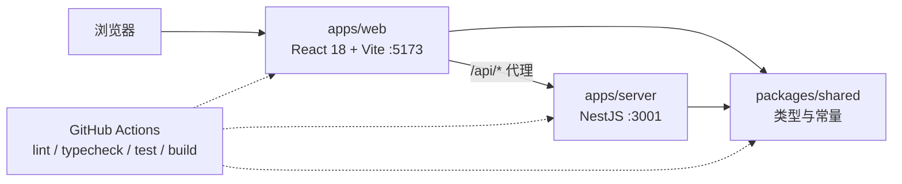

# AI 广告投放 Copilot + 低代码搭建平台（Demo）

Day1 交付可运行、可校验的工程骨架：pnpm monorepo、前后端可启动、基础布局与四条路由、Lint/类型检查/单测/CI 全链路打通。

Day2 交付广告数据看板：顶部筛选（日期区间 / 渠道多选 / 广告计划）、6 张指标卡、3 个 ECharts 图表（消耗点击趋势、渠道对比、转化漏斗）、支持排序分页与列筛选的明细表，并把构建产物按路由懒加载 + manualChunks 拆到全部 chunk < 500KB。

看板数据当前来自前端 mock（`VITE_API_MODE=mock`，默认），接口契约见下文；切到真实后端只需设置 `VITE_API_MODE=real`，页面与 hooks 无需改动。当前**仍不接数据库、不接 LLM**，唯一的后端接口是探活用的 `GET /api/health`。

## 技术栈

| 层     | 选型                                                               |
| ------ | ------------------------------------------------------------------ |
| 前端   | React 18 + TypeScript + Vite + Ant Design + ECharts + React Router + Zustand |
| 后端   | Node.js + NestJS + TypeScript                                      |
| 共享层 | `@ai-ad-copilot/shared`（跨端类型与常量）                          |
| 测试   | 前端 Vitest + Testing Library，后端 Jest                           |
| 工程   | ESLint(flat config) + Prettier + GitHub Actions                    |

## 架构



数据流：浏览器访问 `/api/*` 由 Vite dev server 代理到 NestJS；NestJS 用全局拦截器把返回值包装成 `ApiResponse<T>`，用全局异常过滤器把错误包装成 `ApiErrorResponse`，两端结构都由 `packages/shared` 定义。

## 目录结构

```
apps/
  web/                 React 18 + Vite 前端
    src/
      layouts/         基础布局（侧边栏 + 顶部栏）
      router/          路由表与侧边栏菜单数据（Dashboard 路由级懒加载）
      pages/           Dashboard（看板编排 + 筛选栏 / 明细表 / 查询逻辑）/ AI Copilot / LowCode / RAG / NotFound
      components/      通用组件（MetricCard / ChartCard / PageFallback）
      components/charts/   BaseChart（唯一接触 echarts 的组件）+ chartOptions 纯函数 + 具体图表
      hooks/           异步数据 hooks（useAsyncResource / 概览 / 明细 / 计划下拉）
      services/        数据源与接口契约（http + mock 两种实现，可切换到真实后端）
      stores/          Zustand 状态（含看板筛选）
      utils/           日期与格式化纯函数
      test/            测试专用入口组件与全局测试桩
  server/              NestJS 后端
    src/
      modules/health/  探活接口
      common/          异常过滤器、响应拦截器、错误码
      app.setup.ts     全局装配（main.ts 与集成测试共用）
packages/
  shared/              跨端类型与常量（tsc 编译到 dist）
.github/workflows/     CI
```

## 接口契约（Day2 看板）

前后端共用 `packages/shared/src/types/dashboard.ts` 的类型与常量。日期为 `YYYY-MM-DD` 闭区间（业务日切按 Asia/Shanghai），数组参数用逗号分隔，空值不进入 query。当前前端以 mock 实现落地，后端就绪后按同一契约实现即可。

| 方法 | 路径                      | 说明                                                       |
| ---- | ------------------------- | ---------------------------------------------------------- |
| GET  | `/api/dashboard/overview` | 指标卡 + 趋势 + 渠道对比 + 漏斗，一次请求返回整屏聚合结果  |
| GET  | `/api/dashboard/records`  | 广告计划明细（服务端分页 / 排序 / 列筛选）                 |
| GET  | `/api/ad-plans`           | 广告计划下拉选项（可按渠道、状态、关键字收窄）             |

| 接口     | 参数                                                       | 类型                              |
| -------- | ---------------------------------------------------------- | --------------------------------- |
| overview | `from`, `to`                                               | `string`（YYYY-MM-DD，必填）      |
| overview | `channels`                                                 | `AdChannel[]`（逗号分隔，省略=全部） |
| overview | `planId`                                                   | `string`                          |
| records  | overview 全部参数 + `page`, `pageSize`                     | `number`                          |
| records  | `sortField`, `sortOrder`                                   | `AdRecordSortField` / `asc\|desc` |
| records  | `statuses`, `keyword`                                      | `AdPlanStatus[]` / `string`       |
| ad-plans | `channels`, `statuses`, `keyword`                          | 同上，均可选                      |

| 接口     | `data` 类型                 | 关键字段                                                                        |
| -------- | --------------------------- | ------------------------------------------------------------------------------- |
| overview | `DashboardOverview`         | `metrics` / `previous`（环比对照期）/ `trend` / `channels` / `funnel` / `updatedAt` |
| records  | `PageResult<AdPlanRecord>`  | `list` / `total` / `page` / `pageSize`                                          |
| ad-plans | `AdPlanOption[]`            | `planId` / `planName` / `channel` / `status`                                    |

口径：`spend` / `revenue` 单位为元；`ctr` / `cvr` 返回比值（`0.0342` 表示 3.42%），百分比与万/亿单位由前端 `utils/format.ts` 统一渲染；`roi = revenue / spend`，分母为 0 时返回 0。错误沿用 `ApiErrorResponse`（`code` / `message` / `details`），前端 `services/http.ts` 统一转成 `ApiRequestError` 供 UI 展示。

## 环境要求

- Node.js 22 LTS（仓库内 `.nvmrc` 已写 `22`；本地当前若是 24.x 也能跑，但 CI 与文档以 22 为准）
- pnpm（版本由根 `package.json` 的 `packageManager` 字段锁定）
- Windows PowerShell 下 `pnpm` / `npm` 的 `.ps1` 包装脚本可能被执行策略拦截，请统一用 `pnpm.cmd`，或执行 `Set-ExecutionPolicy -Scope Process RemoteSigned`

## 启动方式

```bash
pnpm.cmd install          # 安装依赖
pnpm.cmd dev              # 同时启动前端(5173) 与后端(3001)
```

也可以单独启动：

```bash
pnpm.cmd --filter @ai-ad-copilot/web dev
pnpm.cmd --filter @ai-ad-copilot/server dev
```

注意：`packages/shared` 需要先构建出 `dist`（根 `dev` / `typecheck` / `test` 脚本已自动处理）。单独调试 shared 时可跑 `pnpm.cmd --filter @ai-ad-copilot/shared dev` 进入 watch 模式。

## 验收命令

```bash
pnpm.cmd lint        # ESLint，零 warning 通过
pnpm.cmd typecheck   # tsc --noEmit，三个包全部通过
pnpm.cmd test        # Vitest(shared/web) + Jest(server)
pnpm.cmd build       # shared -> web/server 按依赖顺序构建
```

CI（`.github/workflows/ci.yml`）在 push 到 `main` 与所有 PR 上执行同样四步。

## Day1 Demo 内容

1. 启动后访问 http://localhost:5173 ，侧边栏含 Dashboard / AI Copilot / LowCode / RAG 四个入口；
2. 顶部栏显示当前页面标题，折叠按钮可收起侧边栏；
3. 点击菜单切换路由，根路径自动重定向到 `/dashboard`，未知路径显示 404；
4. 后端 `GET http://localhost:3001/api/health` 返回 `{"code":0,"message":"ok","data":{...}}`，未知路由返回统一错误结构。

## Day2 Demo 内容（广告数据看板）

1. 访问 http://localhost:5173/dashboard （或 `pnpm.cmd --filter @ai-ad-copilot/web preview` 后的 4173 端口）：
   - 顶部筛选：日期区间（含近 7/14/30 天快捷项，默认近 14 天）、渠道多选、广告计划下拉；计划选项随渠道收窄，渠道变化会自动清空落到未选中渠道的计划；
   - 6 张指标卡：消耗 / 点击 / 转化 / CTR / CVR / ROI，带环比（消耗升高按"变差"配色）；
   - 3 个 ECharts 图表：消耗与点击趋势（双 Y 轴折线）、渠道对比（消耗 / 收入柱状）、转化漏斗（曝光 → 点击 → 转化 → 成交）；
   - 明细表：消耗 / 收入 / 点击 / 转化 / CTR / CVR / ROI / 更新时间可排序，10 / 20 / 50 分页，计划名列关键字筛选 + 状态列多选筛选（全部按服务端语义下推到查询参数）。
2. loading / 错误 / 空态：切换筛选先进入 loading，图表与表格各自展示错误与重试；选中"已结束"计划并把区间挪到其截止日之后可复现空态；
3. 数据源切换：默认 mock（5 个渠道 × 6 个计划 = 30 个广告计划，种子化随机保证同参数结果完全可复现）；`VITE_API_MODE=real` 走真实 `/api`；`VITE_MOCK_DELAY` / `VITE_MOCK_FAILURE_EVERY` 可模拟延迟与接口异常，见 `apps/web/.env.example`；
4. 构建产物（Day2 实测）：入口 496KB / react 235KB / 明细表 239KB / 看板 220KB / echarts 345KB / zrender 169KB / dayjs 15KB / tslib 0.5KB，全部低于 Vite 默认 500KB 阈值，构建无体积警告。Dashboard 通过路由级懒加载按需下载，echarts 仅由 `components/charts/BaseChart.tsx` 接触。

## 后续规划

- Day2（已完成）：Dashboard 筛选 / 指标卡 / ECharts 图表 / 明细表 + 看板接口契约（Prisma + PostgreSQL 数据层顺延到后端接入时）
- Day3：AI Copilot 对话与 SSE 流式输出
- Day4：低代码 Schema 生成与渲染
- Day5：RAG 知识库检索问答
- 贯穿：Playwright E2E（当前 CI 尚未包含，属于已知缺口）
